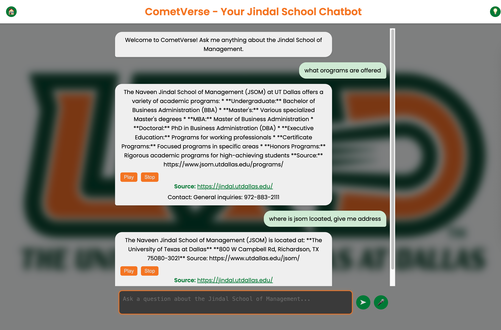

# Jindal School Bot (CometVerse)

A Flask-based web application that acts as a conversational bot (CometVerse) for the Jindal School of Management (JSOM) at UT Dallas. The bot uses the Groq API to provide answers to questions based on pre-scraped data stored in a JSON file.
To view the technical architecture and product market study [View Full Project Report (PDF)](CometVerse(1).pdf)


## Features
- Answers questions about JSOM using pre-scraped web content.
- Provides audio responses via text-to-speech (gTTS).
- Includes source links and contact information in responses.
- Handles large datasets with token limit management for the Groq API.

## Prerequisites
- Python 3.8 or higher
- Git (for cloning the repository)
- An API key from Groq (sign up at [https://console.groq.com](https://console.groq.com))

## Installation

1. **Clone the Repository**
   ```bash
   git clone https://github.com/your-username/your-repo.git
   cd your-repo
   ```

2. **Set Up a Virtual Environment**
   ```bash
   python -m venv venv
   source venv/bin/activate  # On Windows: venv\Scripts\activate
   ```

3. **Install Dependencies**
   ```bash
   pip install -r requirements.txt
   ```

4. **Configure Environment Variables**
   - Create a `.env` file in the root directory.
   - Add your Groq API key:
     ```
     GROQ_API_KEY=your_groq_api_key_here
     ```

5. **Prepare Scraped Data**
   - Ensure `scraped_data.json` is in the root directory with the expected format (a list of objects with `url` and `content` fields). Example:
     ```json
     [
         {"url": "https://jindal.utdallas.edu/", "content": "Jindal School content..."},
         {"url": "https://utdallas.edu/", "content": "UT Dallas content..."}
     ]
     ```

## Usage
1. **Run the Application**
   ```bash
   python app.py
   ```
   - The app will run on `http://0.0.0.0:5001` by default.

2. **Interact with the Bot**
   - Use a tool like Postman or a custom frontend to send POST requests to `/ask` with a JSON body:
     ```json
     {
         "text_question": "What is the impact of mentors?"
     }
   ```
   - The response will include `answer`, `audio` (URL to an MP3 file), `link`, and `contact` fields.

## Configuration
- Adjust `max_entries`, `max_content_length`, and `max_tokens` in `app.py` to manage token limits for the Groq API.
- Modify the port in `app.run()` if needed (default is 5001).

## Contributing
1. Fork the repository.
2. Create a feature branch: `git checkout -b feature-name`.
3. Commit your changes: `git commit -m "Description of changes"`.
4. Push to the branch: `git push origin feature-name`.
5. Open a pull request.

## License
[MIT License](LICENSE) (or specify your preferred license).

## Acknowledgments
- Groq API for AI capabilities.
- gTTS for text-to-speech functionality.
- UT Dallas Jindal School of Management for the content inspiration.

## Issues
Report any bugs or feature requests in the [Issues](https://github.com/your-username/your-repo/issues) tab.
